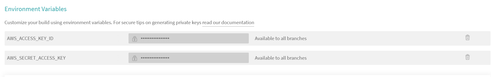
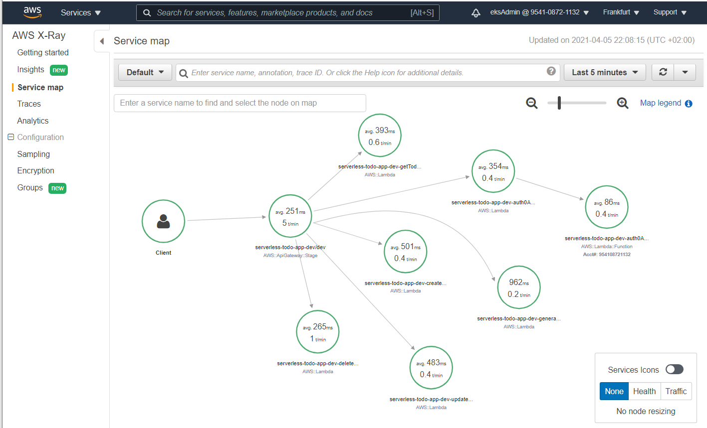

# Serverless TODO Application - Udacity Cloud Developer Nanodegree Project
## 04.Apr.2021 : Stefanos Kotsonis

## Description
This project is is for the [Udacity Cloud Developer Nanodegree](https://www.udacity.com/course/cloud-developer-nanodegree--nd9990), and specifically course 5 **Develop & Deploy Serverless App**. In this course we learned both the theory of using serverless technologies with the practice of developing a complex serverless application. We also learned advanced serverless features such as implementing WebSockets and stream processing.

The task is to develop an todo serverless service for users to create, store, modify, and delete items from their todo list. The service allows for each todo item to have also a picture attached to it. A serverless REST APIs was built using API Gateway and AWS Lambda, a stack of serverless technologies on AWS. The data is stored in AWS DynamoDB and S3, and the application is secured with oAuth authentication. Finally, it is deployed  to Amazon Web Services using Serverless framework.

# Functionality of the application

This application allows creating/removing/updating/fetching TODO items. Each TODO item can optionally have an attachment image. Each user only has access to TODO items that he/she has created.

# TODO items

The application stores TODO items in an AWS DynamoDb database, and each TODO item contains the following fields:

* `userId` (string) - a unique id for a user
* `todoId` (string) - a unique id for an item
* `timestamp` (string) - date and time when an item was created
* `name` (string) - name of a TODO item (e.g. "Change a light bulb")
* `dueDate` (string) - date and time by which an item should be completed
* `done` (boolean) - true if an item was completed, false otherwise
* `attachmentUrl` (string) (optional) - a URL pointing to an image attached to a TODO item


### Prerequisites
To implement this project you need to have the following:
1. An AWS account which you can create via the free tier at [AWS Free Tier](https://aws.amazon.com/free/?all-free-tier.sort-by=item.additionalFields.SortRank&all-free-tier.sort-order=asc)
2. Install the [AWS CLI](https://aws.amazon.com/cli/?nc2=type_a) on your development machine and initialize with your AWS credentials
3. The Node Package Manager (NPM). You will need to download and install Node from [https://nodejs.com/en/download](https://nodejs.org/en/download/). This will allow you to be able to run `npm` commands to install dependent libraries.
4. The following are two important components of our backend solution:
   1. installing [Serverless framework](https://www.serverless.com/) with `npm install -g serverless`
   2. installing the [AWS SDK](https://docs.aws.amazon.com/sdk-for-javascript/v2/developer-guide/installing-jssdk.html) with `npm install --save-dev aws-sdk` 
5. The frontend is created with [React](https://reactjs.org/) which will need the following:
   1. Install React with `npm install react react-dom --save`
   2. Install [Babel](https://babeljs.io/) compiler with `npm install babel-core babel-loader babel-preset-env babel-preset-react babel-webpack-plugin --save-dev`
   
## Project Challenge
Following lambda functions will have to be implemented and configured in the backend [serverless.yml](backend/package-lock.json) file.
* `Auth` - this function should implement a custom authorizer for API Gateway that should be added to all other functions.
* `GetTodos` - should return all TODOs for a current user.
* `CreateTodo` - should create a new TODO for a current user.
* `UpdateTodo` - should update a TODO item created by a current user.
* `DeleteTodo` - should delete a TODO item created by a current user.
* `GenerateUploadUrl` - returns a pre-signed URL that can be used to upload an attachment file for a TODO item.

# Solution
The following was implemented as a solution to the project challenge.

## CI/CD setup
We build out a CI/CD process using [Travis CI](https://travis-ci.org/) that automatically builds and deploys our serverless service to AWS. To make development easier, our [.travis.yml](.travis.yml) script encapsulates the branch in the deployment, so that our `master` app is not affected by changes/features done in our `dev` branch.
To allow for serveless to deploy on our behalf on AWS, the `AWS_SECRET_ACCESS_KEY` and `AWS_ACCESS_KEY_ID` have to be stored in the settings of our travis repository.


### Project backend code structure

The project code base is mainly located within the `src` folder. This folder is divided in:

- `functions` - containing code base and configuration for the lambda functions
- `libs` - containing shared code base between the lambdas
- `resources` - containing the configurations for the service resources

```
.
├── src
│   ├── functions               # Lambda configuration and source code folder
│   │   ├── auth                # auth event functions
│   │   │   └── auth0Authorizer
│   │   │       ├── index.ts        # lambda Serverless configuration
│   │   │       └── handler.ts      # lambda source code
│   │   ├── http                    # http event functions
│   │   │   ├── createTodo
│   │   │   │   ├── index.ts        # lambda Serverless configuration
│   │   │   │   ├── handler.ts      # lambda source code
│   │   │   │   └── schema.ts       # lambda input event JSON-Schema
│   │   │   ├── deleteTodo
│   │   │   │   ├── index.ts        # lambda Serverless configuration
│   │   │   │   └── handler.ts      # lambda source code
│   │   │   ├── generateUploadUrl
│   │   │   │   ├── index.ts        # lambda Serverless configuration
│   │   │   │   ├── handler.ts      # lambda source code
│   │   │   │   └── schema.ts       # lambda input event JSON-Schema
│   │   │   ├── getTodos
│   │   │   │   ├── index.ts        # lambda Serverless configuration
│   │   │   │   └── handler.ts      # lambda source code
event JSON-Schema
│   │   │   └── updateTodo
│   │   │       ├── index.ts        # lambda Serverless configuration
│   │   │       ├── handler.ts      # lambda source code
│   │   │       └── schema.ts       # lambda input event JSON-Schema
│   │   │
│   │   └── index.ts            # Import/export of all lambda configurations
│   │
│   ├── libs                    # Lambda shared code
│   │   ├── database.ts             # DynamoDB interface functions
│   │   ├── getUserId.ts            # helper function to get UserId from JWT
│   │   ├── logger.ts               # Winston logger interface functions
│   │   ├── storage.ts              # S3 interface functions
│   │   ├── apiGateway.ts           # API Gateway specific helpers
│   │   ├── handlerResolver.ts      # Sharable library for resolving lambda handlers
│   │   └── lambda.ts               # Lambda middleware
│   │
│   └── resources               # Serverless resources configurations
│       ├── dynamoDb.ts             # DynamoDB configuration
│       └── s3.ts                   # s3 configuration
├── serverless.ts               # Serverless service file
└── tsconfig.paths.json         # Typescript paths
```

## Handling Secrets in serverless
In order not to expose secrets in our source code or serverless.yml file, the following strategy was used:
* Our libraries retrieve app specific endpoints/names from the `serverless.yml` environment variables. Example from [database.ts](backend/src/libs/database.ts) below:
  ```typescript
    const todosTable = process.env.TODOS_TABLE
    const todoIndex = process.env.TODO_ID_INDEX
    ```
* [serverless.yml](backend/serverless.ts) first looks up our secret using [AWS Secrets Manager](https://aws.amazon.com/secrets-manager/) and stores it under custom section.
* Then it creates these environment variables by using the AWS secret values

Excerpt from [serverless.yml](backend/serverless.ts) below:
```typescript
const serverlessConfiguration: AWS = {
    ...
    custom: {
        todoSecrets: "${ssm:/aws/reference/secretsmanager/todo/app}",  
    },
    provider: {
        ...
        environment: {
            TODOS_TABLE: "${self:custom.todoSecrets.tableName}${self:provider.stage}", 
            TODO_ID_INDEX: "${self:custom.todoSecrets.todoIndex}${self:provider.stage}",
            TODOS_S3_BUCKET: "${self:custom.todoSecrets.s3Endpoint}${self:provider.stage}",
            JWKS: "${self:custom.todoSecrets.jwksUrl}"

    },
```

## `Auth` Function - Authorization
[Auth0](https://auth0.com/) was used as an authentication and authorization platform. Auth0 was chosen due to it's easy (allows users to sign-in with their Google credentials), and also safety with asymmetrically encrypted JWT tokens.

On the client side, we stored the `domain` and `clientId` so that calls to `auth0.WebAuth` will use them .
```javascript
auth0 = new auth0.WebAuth({
    domain: authConfig.domain,
    clientID: authConfig.clientId,
    redirectUri: authConfig.callbackUrl,
    responseType: 'token id_token',
    scope: 'openid'
  });
```

On the backend side, we use [RS256 and JWKS](https://auth0.com/blog/navigating-rs256-and-jwks/) to verify the token passed by the client [auth0Authorizer](backend/src/functions/auth/auth0Authorizer/handler.ts)

## `GetTodos` Function - Retrieve all todos of a user

First, we setup a [DynamoDB](https://aws.amazon.com/dynamodb) NoSQL database on the cloud that will store our todo items.
The spec for this database ([dynamoDb.ts](backend/src/resources/dynamoDb.ts)) partitions the todo items by `userId` and sorts by `timestamp`.
A secondary index is created which indexes by `todoId` to allow for querying by `todoId`.

The lambda function that will serve the route `GET \todos` is provided in [handler.ts](backend/src/functions/http/getTodos/handler.ts). To allow for easily porting to other cloud architectures, a [Hexagonal - ports and adapters](https://en.wikipedia.org/wiki/Hexagonal_architecture_(software)#:~:text=The%20hexagonal%20architecture%2C%20or%20ports,means%20of%20ports%20and%20adapters.) architecture is done, where all adapters for interacting with the database are performed by the library [database.ts](backend/src/libs/database.ts).

The definition for this function makes sure that it has the relevant **iamRole** and also that only **authenticated users** will be served. This is done through the specific function definition for serverless found in the [index.ts](backend/src/functions/http/getTodos/index.ts) for this function, as follows:
```typescript
events: [
{
    http: {
    method: 'get',
    path: 'todos',
    cors: true,
    authorizer: 'auth0Authorizer'
    }
}
],
iamRoleStatements: [
{
    Effect: 'Allow',
    Action: [
        'dynamodb:Query',
    ],
    Resource: ["arn:aws:dynamodb:${self:provider.region}:*:table/${self:provider.environment.TODOS_TABLE}"]
}
]
```
## `CreateTodo` Function - Create a new Todo for a user
The `createTodo` lambda function is provided in [handler.ts](/backend/src/functions/http/createTodo/handler.ts).

The steps this function does are as follows:
* using the [uuid](https://www.npmjs.com/package/uuid) we create an RFC4122 version 4 Universally Unique Identifier for the todo item.
* We get the current date/time to create a `timestamp` for this item
* We retrieve the `userId` using the **JWT Authorization token**
* We retrieve the data from the body of the request (`name` and `dueDate`)
* We put this item in the database


Prior to executing this function, the defintion of our function for serverless in [index.ts](backend/src/functions/http/createTodo/index.ts) makes sure that APIGateway has first checked that:
* User is **authorized**
* Request **body conforms** to our [schema.ts](backend/src/functions/http/createTodo/schema.ts)
* Function has appropriate **iamRole** to put items in the database
### validating the create request
We check that a valid name has been provided for a todo item both at the client side and the backend.
#### On the client side
We match the name to a regex that accepts everything except a space or blank name. This is done in [Todos.tsx](client/src/components/Todos.tsx) on the `onTodoCreate` function as follows:
```typescript
onTodoCreate = async (event: React.ChangeEvent<HTMLButtonElement>) => {
    try {
      if (/^(?!\s*$).+/.test(this.state.newTodoName) === false) {
        alert('Please enter a name for this todo item')
        return 
      }
      const dueDate = this.calculateDueDate()
      const newTodo = await createTodo(this.props.auth.getIdToken(), {
        name: this.state.newTodoName,
        dueDate
      })
      this.setState({
        todos: [...this.state.todos, newTodo],
        newTodoName: ''
      })
    } catch {
      alert('Todo creation failed')
    }
  }
```
#### On the backend side
Our [schema.ts](backend/src/functions/http/createTodo/schema.ts) checks that `name` is non-empty by matching it to the pattern as follows:
```typescript
export default {
    type: "object",
    properties: {
      name: { 
        type: 'string',
      pattern: '^(?!\s*$).+' },
      dueDate: {type: 'string'}
    },
    required: [
      'name', 
      'dueDate'
    ]
  } as const;
```
## `UpdateTodo` Function - update a TODO item
The `updateTodo` lambda function is provided in [handler.ts](/backend/src/functions/http/updateTodo/handler.ts).

The steps this function does are as follows:
* We retrieve the `userId` using the **JWT Authorization token**
* We retrieve the `todoId` from the path parameters
* We check if this todo item exists in the database, by querying over the secondary index
* If yes, we retrieve the new status from the request body
* We update the entry in the database


Prior to executing this function, the defintion of our function for serverless in [index.ts](backend/src/functions/http/updateTodo/index.ts) makes sure that APIGateway has first checked that:
* User is **authorized**
* Request **body conforms** to our [schema.ts](backend/src/functions/http/updateTodo/schema.ts)
* Function has appropriate **iamRole** to query and update items in the database

## `DeleteTodo` Function - delete a TODO item
The `deleteTodo` lambda function is provided in [handler.ts](/backend/src/functions/http/deleteTodo/handler.ts).

The steps this function does are as follows:
* We retrieve the `userId` using the **JWT Authorization token**
* We retrieve the `todoId` from the path parameters
* We check if this todo item exists in the database, by querying over the secondary index
* Then:
  * we check if this todo item had an `attachmentUrl` by using `hasOwnProperty('attachmentUrl')`
  * We delete the relevant bucket, by first extracting the `bucketKey` from the `attachmentUrl` using a regex as follows:
  ```typescript
    let re = /.*amazonaws\.com\/(.*)/i
    let match = re.exec(attachmentUrl)
  ``` 

* Finally, using the `timestamp` key we retrieved from the database query, we proceed to delete the item from the database


Prior to executing this function, the defintion of our function for serverless in [index.ts](backend/src/functions/http/deleteTodo/index.ts) makes sure that APIGateway has first checked that:
* User is **authorized**
* Function has appropriate **iamRole** to :
  * query and delete items in the database
  * delete items in the s3 store

## `GenerateUploadUrl` Function - returns a pre-signed URL to upload an attachment file for a TODO item.
First, we setup a [S3](https://aws.amazon.com/s3) data store on the cloud that will store the todo items attachments.
The spec for this store ([s3.ts](backend/src/resources/s3.ts)) creates the store and the `BucketPolicy` to allow for interactions with this store.
The interactions with this store is performed through our library [storage.ts](backend/src/libs/storage.ts), so that our lambda functions are agnostic to the specific data store API used.

The `generateUploadUrl` lambda function is provided in [handler.ts](/backend/src/functions/http/generateUploadUrl/handler.ts).

The steps this function does are as follows:
* We retrieve the `userId` using the **JWT Authorization token**
* We retrieve the `todoId` from the path parameters
* We check if this todo item exists in the database, by querying over the secondary index
* If yes, we retrieve the filename from the request body and create a bucket key that will include the `todoId` to avoid filename clashes between different todo items
  ```typescript 
  const bucketKey = `${todoId}/${fname}
  ```
* We update the todo entry in the database with the `attachmentUrl` that will be as follows:
  ```typescript
  const url = `https://${bucketName}.s3.amazonaws.com/${bucketKey}`
  ```
* We retrieve a `SignedUrl` for a `PUT` operation on our S3 data store using the AWS SDK getSignedUrl function as follows:
  ```typescript
    AWS.s3.getSignedUrl("putObject", {
        Bucket: bucketName,
        Key: bucketKey,
        Expires: urlExpiration,
  });
  ```

Prior to executing this function, the defintion of our function for serverless in [index.ts](backend/src/functions/http/generateUploadUrl/index.ts) makes sure that APIGateway has first checked that:
* User is **authorized**
* Request **body conforms** to our [schema.ts](backend/src/functions/http/generateUploadUrl/schema.ts)
* Function has appropriate **iamRole** to :
  * query and update items in the database
  * put objects on the s3 data store


## Debugging / tracing our application
We use [AWS X-Ray](https://aws.amazon.com/xray/) to trace calls to the AWS services.
Implementing this requires installation of the [aws-xray-sdk](https://www.npmjs.com/package/aws-xray-sdk) library, and then to replace our calls to AWS services as follows:
<table>
<tr>
<td> Standard </td> <td> With X-Ray tracing </td>
</tr>
<tr>
<td> 

```typescript
import * as AWS  from 'aws-sdk' 
const docClient = new AWS.DynamoDB.DocumentClient()
  ...
const s3 = new AWS.S3({
  signatureVersion: "v4",
});
```
</td>
<td>

```typescript
import * as AWS  from 'aws-sdk' 
import { captureAWS } from "aws-xray-sdk-core"; 
var XAWS = captureAWS(AWS);
const docClient = new XAWS.DynamoDB.DocumentClient()
  ...
const s3 = new XAWS.S3({
  signatureVersion: "v4",
});
```
</td>
</tr>
</table>

Once we deploy and use our service with X-Ray enabled, we can obtain a service map on the aws console as per below example:
